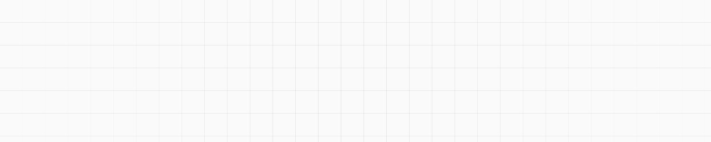

<picture>
  <source media="(prefers-color-scheme: dark)" srcset="assets/banner-dark.svg">
  <source media="(prefers-color-scheme: light)" srcset="assets/banner-light.svg">
  
</picture>

# Andry Orellana 

[![LinkedIn][LinkedIn Badge]][LinkedIn URL]
[![X][X Badge]][X URL]
[![Email][Email Badge]][Email URL]

I build production web platforms for startups and small teams — payments, auth, and the self-hosted infrastructure under them. Mostly TypeScript, Next.js and Postgres.

Independent contractor since 2024. My browser extension serves **4,000 users** on the Chrome Web Store, and I contribute to **JSON Flow**, a VS Code extension with **74,000+ installs**.

##  Currently

- 🔭 **Building** — SaaS platforms in production for clients, plus a self-hosted starter I'm opening up
- 🧰 **Running** — my own infrastructure: Coolify, Docker Compose, and a self-hosted CI runner fleet
- 💬 **Open to** — contract and full-time work

##  Projects

### Bookmark Import/Export 

A browser extension to import and export bookmarks across browsers, in HTML, JSON or CSV. **4,000 users** on the Chrome Web Store. Built and maintained end to end, MIT licensed.

[![Plasmo][Plasmo Badge]][Plasmo URL]
[![React][React Badge]][React URL]
[![TypeScript][TypeScript Badge]][TypeScript URL]
[![TailwindCSS][TailwindCSS Badge]][TailwindCSS URL]
[![Shadcn/UI][Shadcn/UI Badge]][Shadcn/UI URL]

[Chrome Web Store][Bookmark Import/Export Chrome Web Store URL] · [Repository][Bookmark Import/Export Repo URL]

### JSON Flow 

A VS Code extension that turns JSON, YAML, XML and CSV files into interactive graphs — **74,000+ installs**. I built the marketing site end to end and contributed to the extension's React webview: the shadcn/ui migration, theming, a settings dialog with persistence, and layout state.

[![Astro][Astro Badge]][Astro URL]
[![React][React Badge]][React URL]
[![XYFlow][XYFlow Badge]][XYFlow URL]
[![TypeScript][TypeScript Badge]][TypeScript URL]
[![TailwindCSS][TailwindCSS Badge]][TailwindCSS URL]
[![Shadcn/UI][Shadcn/UI Badge]][Shadcn/UI URL]

[Website][JSON Flow URL] · [Repository][JSON Flow Repo URL]

##  Tech Stack

[![TypeScript][TypeScript Badge]][TypeScript URL]
[![Next.js][Next.js Badge]][Next.js URL]
[![React][React Badge]][React URL]
[![Bun][Bun Badge]][Bun URL]
[![Hono][Hono Badge]][Hono URL]
[![PostgreSQL][PostgreSQL Badge]][PostgreSQL URL]
[![Prisma][Prisma Badge]][Prisma URL]
[![TailwindCSS][TailwindCSS Badge]][TailwindCSS URL]

Everything else I work with

 

| Category | Technologies |
| -------- | ------------ |
| Languages & Frontend | [![TypeScript][TypeScript Badge]][TypeScript URL] [![JavaScript][JavaScript Badge]][JavaScript URL] [![React][React Badge]][React URL] [![Next.js][Next.js Badge]][Next.js URL] [![Astro][Astro Badge]][Astro URL] [![TailwindCSS][TailwindCSS Badge]][TailwindCSS URL] [![Shadcn/UI][Shadcn/UI Badge]][Shadcn/UI URL] |
| Backend & Data | [![Node.js][Node.js Badge]][Node.js URL] [![Bun][Bun Badge]][Bun URL] [![Hono][Hono Badge]][Hono URL] [![TRPC][TRPC Badge]][TRPC URL] [![Prisma][Prisma Badge]][Prisma URL] [![PostgreSQL][PostgreSQL Badge]][PostgreSQL URL] [![Zod][Zod Badge]][Zod URL] [![BetterAuth][BetterAuth Badge]][BetterAuth URL] |
| Infrastructure | [![Docker][Docker Badge]][Docker URL] [![Coolify][Coolify Badge]][Coolify URL] [![GitHub Actions][GitHub Actions Badge]][GitHub Actions URL] [![Vercel][Vercel Badge]][Vercel URL] [![Neon][Neon Badge]][Neon URL] |
| Tools | [![Git][Git Badge]][Git URL] [![Playwright][Playwright Badge]][Playwright URL] [![Figma][Figma Badge]][Figma URL] [![Conventional Commits][Conventional Commits Badge]][Conventional Commits URL] |

##  Let's talk

I'm open to contract and full-time work, and always up for a good technical conversation. The fastest way to reach me is [email](mailto:hello@andryore.dev) or [LinkedIn][LinkedIn URL].

[LinkedIn Badge]: https://img.shields.io/badge/LinkedIn-0A66C2.svg?style=for-the-badge&logo=LinkedIn&logoColor=white
[LinkedIn URL]: https://linkedin.com/in/AndryOre
[X Badge]: https://img.shields.io/badge/X-000000.svg?style=for-the-badge&logo=X&logoColor=white
[X URL]: https://x.com/AndryOre
[Email Badge]: https://img.shields.io/badge/Email-EA4335.svg?style=for-the-badge&logo=Gmail&logoColor=white
[Email URL]: mailto:hello@andryore.dev
[Bookmark Import/Export Chrome Web Store URL]: https://chromewebstore.google.com/detail/bookmark-importexport/gdhpeilfkeeajillmcncaelnppiakjhn
[Bookmark Import/Export Repo URL]: https://github.com/AndryOre/bookmarks-import-export
[JSON Flow URL]: https://json-flow.com/
[JSON Flow Repo URL]: https://github.com/ManuelGil/vscode-json-flow
[TypeScript Badge]: https://img.shields.io/badge/TypeScript-3178C6.svg?style=for-the-badge&logo=TypeScript&logoColor=white
[TypeScript URL]: https://www.typescriptlang.org/
[JavaScript Badge]: https://img.shields.io/badge/JavaScript-F7DF1E.svg?style=for-the-badge&logo=JavaScript&logoColor=black
[JavaScript URL]: https://developer.mozilla.org/en-US/docs/Web/JavaScript
[React Badge]: https://img.shields.io/badge/React-61DAFB.svg?style=for-the-badge&logo=React&logoColor=black
[React URL]: https://react.dev/
[Next.js Badge]: https://img.shields.io/badge/Next.js-000000.svg?style=for-the-badge&logo=nextdotjs&logoColor=white
[Next.js URL]: https://nextjs.org/
[Astro Badge]: https://img.shields.io/badge/Astro-BC52EE.svg?style=for-the-badge&logo=Astro&logoColor=white
[Astro URL]: https://astro.build/
[TailwindCSS Badge]: https://img.shields.io/badge/Tailwind%20CSS-06B6D4.svg?style=for-the-badge&logo=Tailwind-CSS&logoColor=white
[TailwindCSS URL]: https://tailwindcss.com/
[Shadcn/UI Badge]: https://img.shields.io/badge/shadcn/ui-000000.svg?style=for-the-badge&logo=shadcnui&logoColor=white
[Shadcn/UI URL]: https://ui.shadcn.com/
[Node.js Badge]: https://img.shields.io/badge/Node.js-5FA04E.svg?style=for-the-badge&logo=nodedotjs&logoColor=white
[Node.js URL]: https://nodejs.org/
[Bun Badge]: https://img.shields.io/badge/Bun-000000.svg?style=for-the-badge&logo=Bun&logoColor=white
[Bun URL]: https://bun.sh/
[Hono Badge]: https://img.shields.io/badge/Hono-E36002.svg?style=for-the-badge&logo=Hono&logoColor=white
[Hono URL]: https://hono.dev/
[TRPC Badge]: https://img.shields.io/badge/tRPC-2596BE.svg?style=for-the-badge&logo=tRPC&logoColor=white
[TRPC URL]: https://trpc.io/
[Prisma Badge]: https://img.shields.io/badge/Prisma-2D3748.svg?style=for-the-badge&logo=Prisma&logoColor=white
[Prisma URL]: https://www.prisma.io/
[PostgreSQL Badge]: https://img.shields.io/badge/PostgreSQL-4169E1.svg?style=for-the-badge&logo=PostgreSQL&logoColor=white
[PostgreSQL URL]: https://www.postgresql.org/
[Zod Badge]: https://img.shields.io/badge/Zod-3E67B1.svg?style=for-the-badge&logo=Zod&logoColor=white
[Zod URL]: https://zod.dev/
[BetterAuth Badge]: https://img.shields.io/badge/Better%20Auth-000000.svg?style=for-the-badge&logo=betterauth&logoColor=white
[BetterAuth URL]: https://www.better-auth.com/
[Docker Badge]: https://img.shields.io/badge/Docker-2496ED.svg?style=for-the-badge&logo=Docker&logoColor=white
[Docker URL]: https://www.docker.com/
[Coolify Badge]: https://img.shields.io/badge/Coolify-8B5CF6.svg?style=for-the-badge&logo=Coolify&logoColor=white
[Coolify URL]: https://coolify.io/
[GitHub Actions Badge]: https://img.shields.io/badge/GitHub%20Actions-2088FF.svg?style=for-the-badge&logo=githubactions&logoColor=white
[GitHub Actions URL]: https://github.com/features/actions
[Vercel Badge]: https://img.shields.io/badge/Vercel-000000.svg?style=for-the-badge&logo=Vercel&logoColor=white
[Vercel URL]: https://vercel.com/
[Neon Badge]: https://img.shields.io/badge/Neon-00E599.svg?style=for-the-badge&logo=Neon&logoColor=black
[Neon URL]: https://neon.tech/
[Git Badge]: https://img.shields.io/badge/Git-F05032.svg?style=for-the-badge&logo=Git&logoColor=white
[Git URL]: https://git-scm.com/
[Playwright Badge]: https://img.shields.io/badge/Playwright-2EAD33.svg?style=for-the-badge&logo=Playwright&logoColor=white
[Playwright URL]: https://playwright.dev/
[Figma Badge]: https://img.shields.io/badge/Figma-F24E1E.svg?style=for-the-badge&logo=Figma&logoColor=white
[Figma URL]: https://www.figma.com/
[Conventional Commits Badge]: https://img.shields.io/badge/Conventional%20Commits-FE5196.svg?style=for-the-badge&logo=Conventional-Commits&logoColor=white
[Conventional Commits URL]: https://www.conventionalcommits.org/en/v1.0.0/
[Plasmo Badge]: https://img.shields.io/badge/Plasmo-0F0C29.svg?style=for-the-badge&logo=Plasmo&logoColor=white
[Plasmo URL]: https://www.plasmo.com/
[XYFlow Badge]: https://img.shields.io/badge/xyflow-1A192B.svg?style=for-the-badge&logo=xyflow&logoColor=white
[XYFlow URL]: https://xyflow.com/
